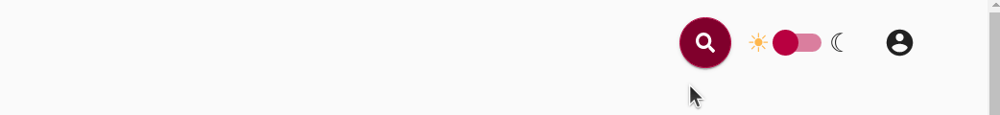
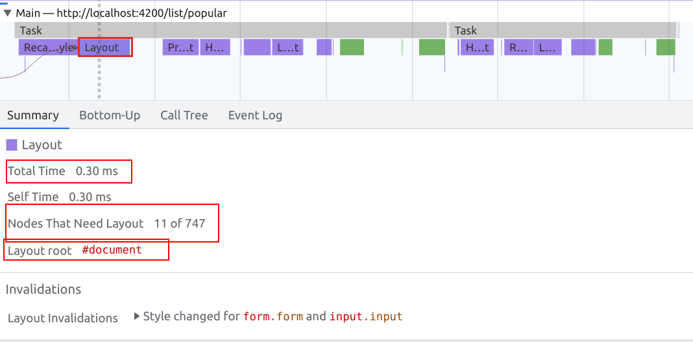
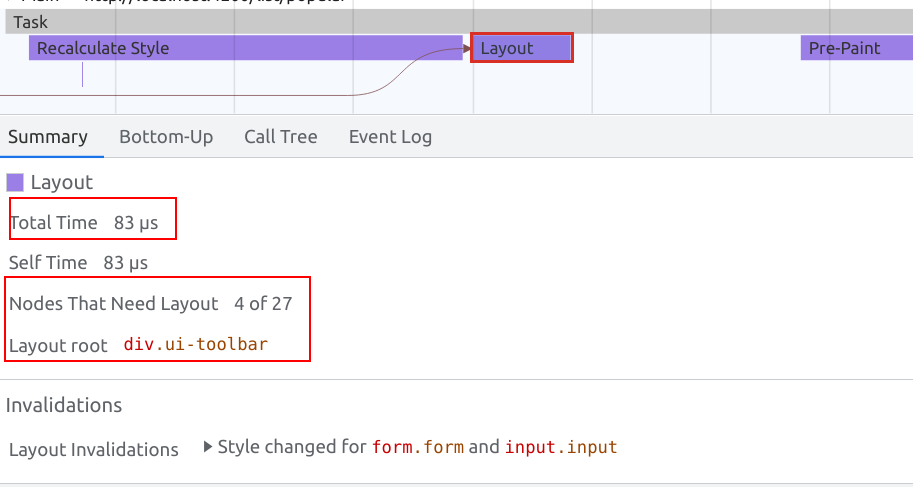
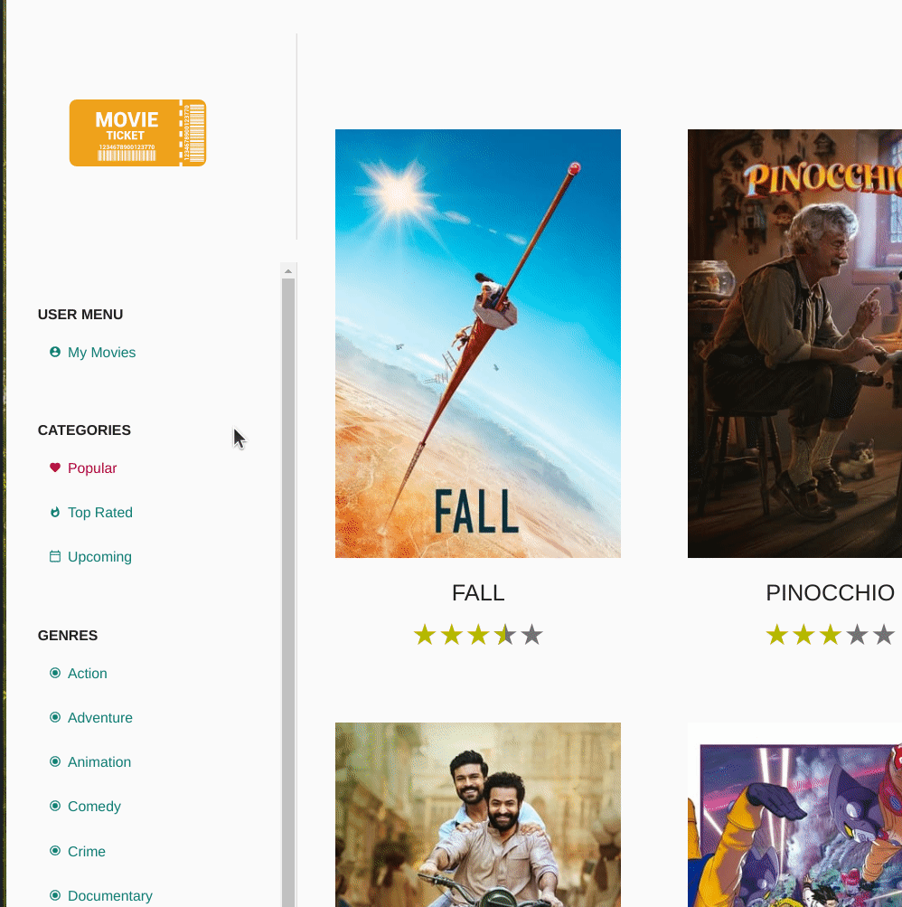
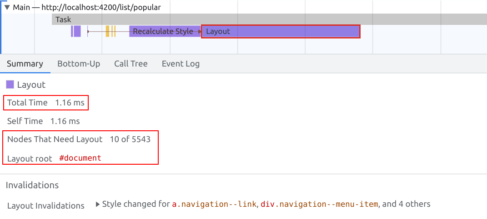
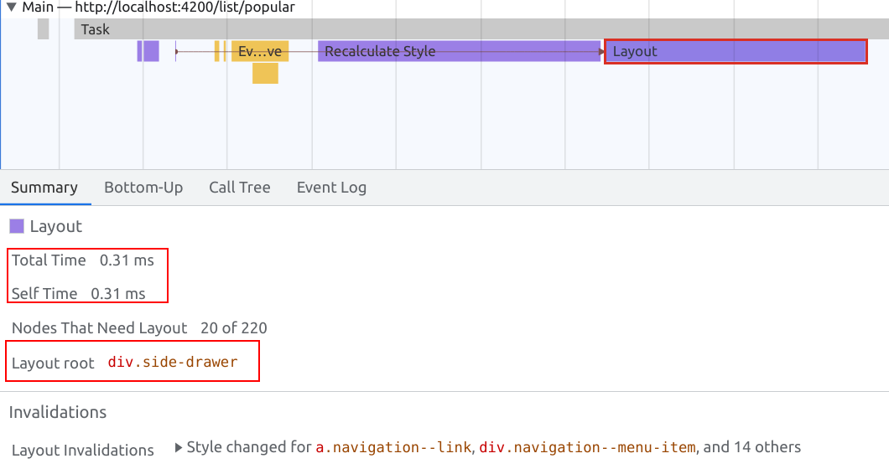

# CSS Performance - Containment

In this exercise you will learn how simple css tricks can have a dramatic impact on the
runtime performance of your application.
We are already aware of the browser render pipeline and know what triggers layout, paint
and style recalculations and in some cases how to avoid them completely.

Anyway, there will always be situations where you cannot avoid execution work in order to get the
desired outcome. However, you as a developer still have options to improve whatever will be executed.

By using the new `css containment` API, you can proactively help the browser to determine sections it can
ignore to relayout, repaint or even completely detach it from the render tree.

## Contain Layout for `.ui-toolbar`

Start off by measuring the current state. Open your browser to show you any movie list,
e.g. `http://localhost:4200/list/popular`.

As we want to make sure the layout will be contained inside of `.ui-toolbar`, let's trigger
a layout inside it. Click the `ui-search-bar` component in order to trigger its animation.
As it is expanding by changing its width, we can be sure the browser has to relayout.

**searchbar animation**
.

Open the devtools with `F12` or `Ctrl + Shift + I` and open the `Performance Tab`.
Create a recording of the searchbar animation an analyse the created profile.

You should see a bunch `layout` tasks being executed while the animation is ongoing.
Inspect a single layout task in order to see its details.
The following metrics are important:
* runtime in ms
* amount of affected DOM Nodes 
* layout root

You should see a similar result to the following:



As you can see, the layout root is `document` and it had to check > `700` nodes in order to find
out what has to get relayouted and what doesn't.

Your task is to implement a css based solution that improves the layout performance and in best case
sets the `layout root` to `.ui-toolbar`.

You have two options to implement this. You either choose to use `contain: strict` or set proper
dimensions and go with `contain: content`. Either way, implement your changes in `app-shell.component.scss`.

<details>
  <summary>contain: strict</summary>

```scss
// app-shell.component.scss

.ui-toolbar {
  /* other stuff */
  contain: strict;
}
```

</details>

<details>
  <summary>contain: content & dimensions</summary>

```scss
// app-shell.component.scss

.ui-toolbar {
  /* other stuff */
  contain: content;
  width: calc(100vw - 250px); // subtract sidebar width

  @include isMobile {
    width: 100vw;
  }
  
}
```

</details>

When you've finished the implementation, please repeat the measurements from before. Inspect the summary of the 
`layout` task again. You should now notice the `Layout` root being set to the set boundary.
Furthermore, the execution time dropped dramatically as well as the amount of inspected dom nodes.



## Contain Layout for `ui-sidedrawer`

Start off by measuring the current state. Open your browser to show you any movie list,
e.g. `http://localhost:4200/list/popular`.

As we want to make sure the layout will be contained inside of `ui-sidedrawer`, let's trigger
a layout inside it. Hover over any navigation item.
As it is setting its font-weight to `bold`, we can be sure the browser has to relayout.



You should notice a `layout` task being executed whenever you hover an item.
Inspect a single layout task in order to see its details.
The following metrics are important:
* runtime in ms
* amount of affected DOM Nodes
* layout root

You should see a similar result to the following:



As you can see, the layout root is `document` and it had to check > `700` nodes in order to find
out what has to get relayouted and what doesn't.

Your task is to implement a css based solution that improves the layout performance and in best case
sets the `layout root` to `.side-drawer`.

You have two options to implement this. You either choose to use `contain: strict` or set proper
dimensions and go with `contain: content`. Either way, implement your changes in `side-drawer.component.scss`.

<details>
  <summary>contain: strict</summary>

```scss
// side-drawer.component.scss

.side-drawer {
  /* other stuff */
  contain: strict;
}
```

</details>

<details>
  <summary>contain: content & dimensions</summary>

```scss
// side-drawer.component.scss

.side-drawer {
  /* other stuff */
  contain: content;
  height: 100vh;  
}
```

</details>

When you've finished the implementation, please repeat the measurements from before. Inspect the summary of the
`layout` task again. You should now notice the `Layout` root being set to the configured boundary.
Furthermore, the execution time dropped dramatically as well as the amount of inspected dom nodes.



## Native Virtual Scrolling for MovieList


