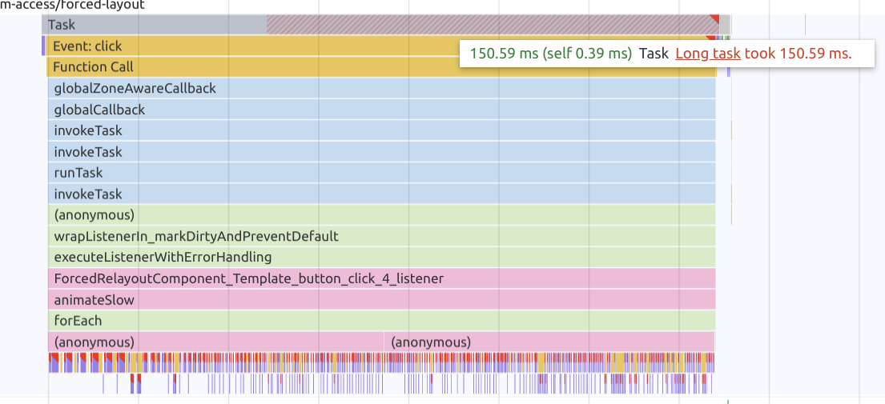
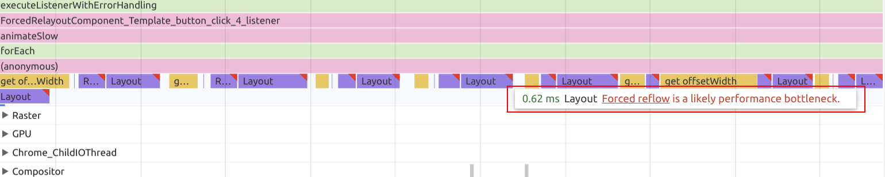
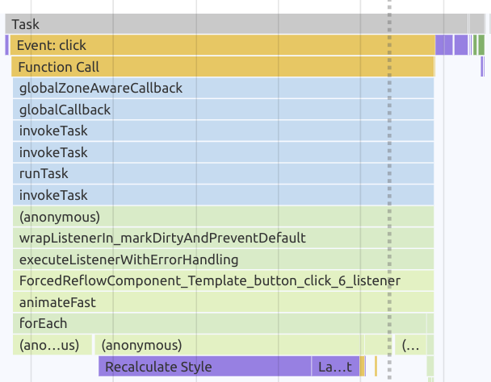
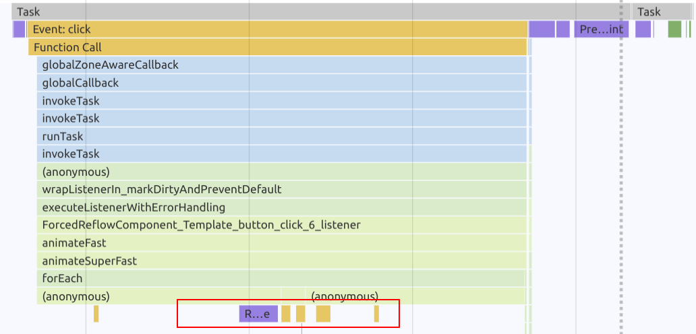

# DOM Access Optimisation - Forced Reflow

In this exercise you will learn what forced reflows are, what causes and how to
avoid them.

## Prepare perf-playground

In order to solve the tasks for this exercise, please run the [perf-playground repository](https://github.com/push-based/perf-playground).

<details>
  <summary>start (if already cloned)</summary>

```bash
npm run start
```

</details>

<details>
  <summary>clone & start</summary>

```bash
git clone https://github.com/push-based/perf-playground.git

cd perf-playground

npm install

npm run start
```

</details>

Open your browser at `http://localhost:4200/dom-access/forced-reflow`.

You will see an interface displaying a chart-like component as well as three
buttons to execute style transformations on the chart component.

Hit the `Animate slow` button in order to trigger the already implemented solution.
A duration counter will give you information about the execution time of the
animation.

## Measure current state

Open your dev tools with `F12` or `Ctrl + Shift + I` and create a recording of the
animation.

When analyzing the flame charts, you should notice two things.

**1. Long Task for click event listener**


The click event listener shows a long task because the task took longer than 50ms
to execute.

**2. Forced Reflow**


The dev tools will also give you warnings about potential performance bottlenecks.
You should see multiple occurrences of `Forced Reflow` warnings.

## Remove forced reflow

Inspect the code of `ForcedReflowComponent` as this is the place where the 
animation is implemented.

Take a look at the `animateSlow` method and identify the cause of the forced reflow.

The animation does the following:
* update label font-sizes
* determine largest label size
* align bars to match the largest label


Something is wrong with the implementation as it causes multiple synchronous forced
reflows.

> Tip: think about read-write cycles. In best case you want to perform
> all write operations before reading from the DOM again

Your task is to implement a solution without forcing reflows.
Implement your solution in the `animateFast` method.

<details>
  <summary>Show Help</summary>

```ts

animateFast(): void {
  // first update all labels (write)
  this.menuItems.forEach(item => {
    const nativeElement = item.nativeElement;
    const label: HTMLElement = nativeElement.querySelector('.label') as HTMLElement;
    label.style.fontSize = fontSize;
  });
  
  // layout is now stable
  // determine largest label (read)
  this.menuItems.forEach(item => {
    const nativeElement = item.nativeElement;
    const label: HTMLElement = nativeElement.querySelector('.label') as HTMLElement;
    largest = Math.max(largest, (label.firstChild as HTMLElement).offsetWidth + 5);
  });
  
  // align bars to largest label (write)
  this.menuItems.forEach(item => {
    const nativeElement = item.nativeElement;
    const bar: HTMLElement = nativeElement.querySelector('.bar') as HTMLElement;
    bar.style.left = `${largest}px`;
  });
}
```

</details>

When you've finished your implementation, make sure to do another recording and
view the flame charts.

You should notice that both, the `long task` as well as the `forced reflows` are gone.



## Bonus: Super fast calculation with compositor only properties

We've improved the animation quite a bit by getting rid of the forced reflows.
There is still room for improvement, though. We can completely get rid of the need
for layout by using compositor only properties.

Your task is to implement a solution that doesn't rely on changing any
layout properties.
Implement your changes in the `animateSuperFast` method of the `ForcedReflowComponent`.

> Tip: use `transform: scale` as replacement for `fontSize` and `translateX` as replacement for `left`.

> Tip: you probably need to use `getBoundingClientRect` in order to read the dimensions of `label.firstChild`


<details>
  <summary>Show Solution</summary>

```ts
animateSuperFast(): void {
    const start = performance.now();
    let largest = 0;
    
    this.fat = !this.fat;
    // set scale instead of fontSize
    const scale = this.fat ? 1.25 : 1;

    this.menuItems.forEach(item => {
      /* other stuff */
      // change transform property instead of `fontSize`
      label.style.transform = `scale(${scale})`;
    });
    // update fontSize and determine largest label
    this.menuItems.forEach(item => {
      /* other stuff */
      // read dimensions with getBoundingClientRect
      largest = Math.max(largest, (label.firstChild as HTMLElement).getBoundingClientRect().width + 5);
    });

    // align bars to largest label
    this.menuItems.forEach(item => {
      /* other stuff */
      // align bar by setting transform: translateX instead of left
      bar.style.transform = `translateX(${largest - 42}px)`;
    });
    this.cdRef.detectChanges();
  }
```

</details>

After you've finished the exercise, please repeat the measurement and do an analysis
of the runtime performance again.

If you were successful, you should see that the layout task is gone from the animation.
The result should look similar to the one below

**No Layout Task**  


