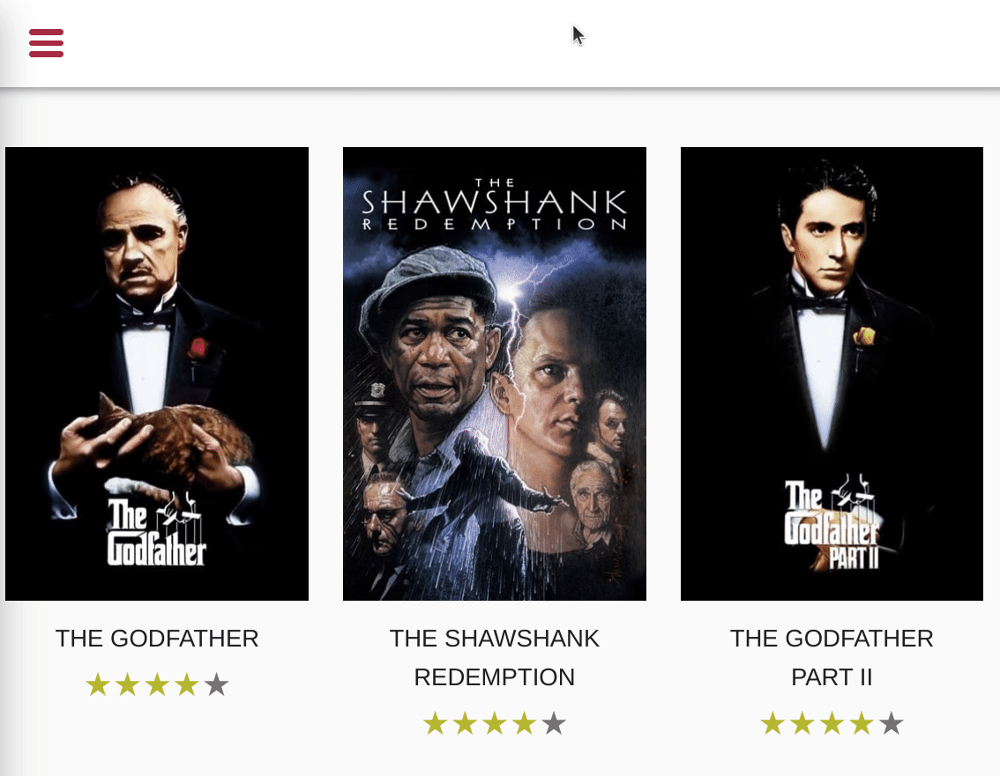

# DOM Access Optimisation - ResizeObserver & IntersectionObserver

In this exercise you will learn how to avoid unnecessary re-layouts. You will implement a
push-based architecture by leveraging advanced DOM APIs like [ResizeObserver](https://developer.mozilla.org/en-US/docs/Web/API/ResizeObserver)
and [IntersectionObserver](https://developer.mozilla.org/en-US/docs/Web/API/IntersectionObserver).

Furthermore, we will improve the performance of css animations by using compositor only properties.

## Improve Tilt Directive

Start off by measuring the current state of the animation that tilts the `movie-card` on hover.
Open your browser to any movie-list page and start the dev tools with `F12` or `Ctrl + Shift + I`.

Do a recording of the animation and inspect the flame charts.


**Tilt Animation**


When analysing the flame charts, you should notice that there is a `layout` task involved
when querying for `getBoundingClientRect`. (it appears the first time you've hovered, on consequent calls the browser appears to be smart and doesn't have to
layout again).


Your task now is to improve the performance of the animation by removing the need for layouting at all.

Go to the `TiltDirective` and make use of the `ResizeObserver` in order to get the dimensions of the directive pushed to in instead
of you having to query for it.

<details>
  <summary>Implement ResizeObserver</summary>

```ts
// tilt.directive.ts

private width = 0;

constructor() {
  const observer = new ResizeObserver((entries) => {
    this.width = entries[0].contentRect.width;
  });
  observer.observe(elementRef.nativeElement);
}
```

</details>

Feel free to add `console.logs` in order to see that the Observer is actually updating values when you resize the window :).

Now that we have the dimension pushed to us, we can use it in order to determine the direction of the animation.

The current implementation relies on the `pageX` property of the `mouseenter` event. It will give you the relative mouse position
to the whole document. Instead of using `pageX`, consider using `offsetX` as it gives us the relative mouse position to
the event target (`movie-card`).

<details>
  <summary>Adjust position determination</summary>

```ts
// tilt.directive.ts

// use offsetX instead of pageX
// determine position by using the stored width and compare it to the offsetX
const pos = this.width / offsetX > 2 ? 0 : 1;

```
</details>

**Well done!!**

Do the measurement again, you should notice that the `Layout` task is completely gone now as we are not querying for
any layout properties.

## Improve Pagination

Start off by measuring the current state of what happens when you are scrolling in the movies-list in order to trigger the
pagination.

Open your browser to any movie-list page and start the dev tools with `F12` or `Ctrl + Shift + I`.

Do a recording of the scroll event and inspect the flame charts.


You should be able to spot a pattern that indicates layout thrashing caused by reading the `scrollHeight` property in javascript.


Your task is to get rid of the layout thrashing. The current implementation relies on querying positional and geometrical information
from DOM elements on each `scroll` event. Use the `IntersectionObserver` to implement a push-based architecture which gives you
information about the visibility of an element.

Implement your changes in the `ElementVisibilityDirective`.
Replace the `scroll` event listener with an `IntersectionObserver` implementation. Whenever the element is `isIntersecting`,
we want to send the result by notifying the `visible` signal.

`this.signals.visible(events[0].isIntersecting);`

<details>
  <summary>Implement IntersectionObserver</summary>

```ts
// element-visibility.directive.ts

const observer = new IntersectionObserver(events => {
  this.signals.visible(events[0].isIntersecting);
}, {
  root: null, // the scrollContainer (document in case of null)
  rootMargin: '100px', // margin
  threshold: 0.5 // how much of the element should be visible before it's considered as intersecting
});

observer.observe(elementRef.nativeElement);
```

</details>

Great job! If you've finished the implementation, repeat the measurement process. You should notice that the flame graph looks much cleaner now
when scrolling. The scroll listener as well as the layout trashing shouldn't be an issue anymore :).

Instead, you should find tasks that are labelled as `compute intersections`.


## Compositor only sidebar

So far we've avoided implemented solutions that avoid javascript DOM Access by using observers to get
push notifications about DOM changes.
Yet, these strategies don't apply to every problem. In this exercise we will learn how to improve the 
performance of css animations by using compositor only properties.

Start off by measuring the current state of the sidebar slide animation.

**Animation**


You should notice two things when analysing the performance recording

**1. Layout Shift**


While the animation is ongoing, you'll notice a lot of `layout shifts` being reported by the chrome dev tools.

**2. Layout Thrashing**


The animation causes multiple consequent `layout` tasks while it is ongoing.

Your task is to find the root cause of the issue and to solve it. Right now, the animation is done
by animating the `left` property from `-250px` to `0`. This moves the sidebar in place.

Implement your changes in `side-drawer.component.scss` as this is the place where the animation is implemented originally.

> `left` is a layout property, thus causing layout shifts and layout tasks for the browser
> 
> `transform: translateX` is also capable of moving things on the `X` axis, but is a `compositor only` propery 

<details>
  <summary>Show Help</summary>

```scss
// src/app/ui/component/side-drawer/side-drawer.component.scss

.side-drawer {
  /*
  * other stuff
  */
  left: -250px;
  transform: translateX(-100%);
}

@media screen and (min-width: 1298px) {
  .side-drawer {
    //left: 0;
    transform: translateX(0);
  }
}
.side-drawer.opened {
  //left: 0;
  transform: translateX(0);
}

```

</details>

Great! When you've finished implementing your improvements, make sure to measure
the outcome again.

You should see both before mentioned issues being gone.

**1. No layout shifts**


**2. No layout task**


