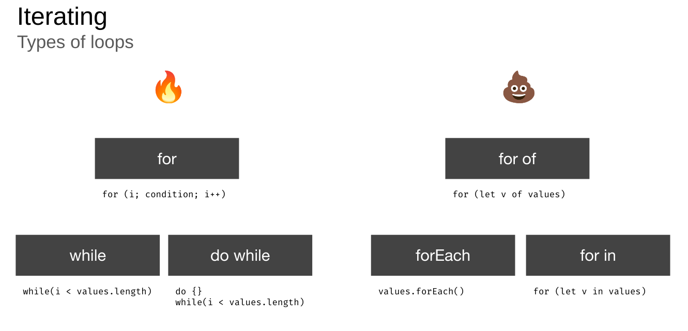

# JS & TS Best Practices

This exercise is about low level performance optimizations. You will discover, learn & benchmark different techniques in order to
improve the scripting performance of pure javascript code.

In order to solve the tasks for this exercise, please clone the [perf-playground repository](https://github.com/push-based/perf-playground).

```bash
git clone https://github.com/push-based/perf-playground.git

cd perf-playground

npm install

npm run start
```

## Loops

### Benchmark Loop Performance

Go to `http://localhost:4200/looping/types-of-loops` and hit the `start` button.
Don't forget to play around with the `iterations` count. The higher you go with the number of iterations,
the clearer the performance differences will be.

In the end, you should observe the following behavior:



### Property Lookups & Reversing

Now it's time for you to implement an "improvement" :-D. 

By following the path of `reduce property lookups` => `reversing` you will introduce
both techniques and benchmark the results.

The `PropertyLookupsReversingComponent` already has everything in place to get you started.
You will find two skeleton methods you will need to implement:

* `reducePropertyLookups`
* `reducePropertyLookupsAndReverse`

**Reduce Property Lookups**

Reduce the amount of property lookups per loop cycle by pre-assigning the `length` property to `items.length`.

<details>
  <summary>Show Help</summary>

```ts
// src/app/looping/property-lookups-reversing/property-lookups-reversing.component.ts

reducePropertyLookups(): void {
  let length = this.items.length;
  for (let i = 0; i < length; i++) {
    this.work(this.items[i]);
  }
}
```
</details>

Cool, open your browser at `http://localhost:4200/looping/property-lookups-reversing`
and benchmark your "improvement".
Don't forget to play around with the `iterations` count. Does it affect the performance? :O

**Reduce Property Lookups & Reversing**

We can further "improve" the runtime performance of our loop by using the reversing technique.
For this, we will change the direction in which we loop through our items. So we will start at
`this.items.length - 1`.
This will give us the opportunity to skip the abortion criteria which will otherwise stop
the loop from being executed as the browser will compare `i == true` on its own.

<details>
  <summary>Show Help</summary>

```ts
// src/app/looping/property-lookups-reversing/property-lookups-reversing.component.ts

reducePropertyLookupsAndReverse(): void {
  for (let i = this.items.length - 1; i--; ) {
  this.work(this.items[i]);
}
}
```
</details>

Well done, open your browser at `http://localhost:4200/looping/property-lookups-reversing`
and benchmark your "improvement".
Don't forget to play around with the `iterations` count. Does it affect the performance? :O

### Avoid Nested Loops

Now it's time to get a real performance boost, promised! :)
The goal is to get know the concept and benefits of `Lookup Tables`.

Open your browser at `http://localhost:4200/looping/avoid-nested-loops`.

Head to the `AvoidNestedLoopsComponent` as this will be the place for you to implement
your improvements.

Inspect the implementation of `nestedLoop` and identify the nested loop.

Your task is to implement a more performant version of this iteration by avoiding 
the nested loop. 
Implement your changes in the `lookupTableLoop` skeleton method.

For this you will probably want to transform `childItems` into some `Map` or `Dictionary` structure.
Feel free to use the already pre-defined `childTable: Record<string, Item>` property, or introduce your own.
It's maybe worthwhile to also take a look at the implementation of the `setItems` method.

> Tip: you can use `toDictionary` from `@rx-angular/cdk/transformations` or implement
> your own version to transform an array into a lookup table

<details>
  <summary>Show Help</summary>

```ts
// src/app/looping/avoid-nested-loops/avoid-nested-loops.component.ts

setItems(amount: string): void {
  this.items = createItems(parseInt(amount));
  this.childItems = createItems(parseInt(amount));
  // create childTable whenever items are set
  this.childTable = toDictionary(this.childItems, 'id');
}

private lookupTableLoop(): void {
  for (let i = 0; i < this.items.length; i++) {
    const item = this.items[i];
    const child = this.childTable[item.refItem];
    this.work(child);
  }
}
```

</details>

Well done, open your browser at `http://localhost:4200/looping/avoid-nested-loops` and
benchmark your implementation against the original one.
Don't forget to play around with the `iterations` count. The higher you go with the number of iterations,
the higher will be the performance difference between the two implementations.

### Reduce Number of Iterations

In the exercise before we've used a `Lookup Table` in to essentially reduce the amount of iterations.
Now we will get to know another technique which can dramatically improve the runtime performance of loops.

Open your browser at `http://localhost:4200/looping/reduce-iterations`.

Head to the `ReduceIterationsComponent` as this will be the place for you to implement
your improvements.

Inspect the implementation of `multipleIterations` and identify the multiple loops.

Your task is to implement a more performant version of this implementation by avoiding
multiple loops over the same values. Consider using a traditional `for loop` approach with
a pre-defined array to push values on top.

Implement your changes in the `singleIteration` skeleton method.

<details>
  <summary>Show Help</summary>

```ts
// src/app/looping/reduce-iterations/reduce-iterations.component.ts

private singleIteration(): void {
  let mapped: Item[] = [];
  for (let i = 0; i < this.items.length; i++) {
    const item = this.items[i];
    if (this.work(item)) {
      mapped.push(item);
    }
  }
}
```

</details>

Well done, open your browser at `http://localhost:4200/looping/reduce-iterations` and
benchmark your implementation against the original one.
Don't forget to play around with the `iterations` count. You should observe the `single` iteration
implementation will always be around `50 %` faster.

## Data Structures

### Lookup Tables

We are already aware of the concept of a `Lookup Table`. Let's dig further into it and get to know
the real benefits of high-speed read access data structures.

We will get to know yet another technique which can dramatically improve the runtime performance 
of javascript functions.

Open your browser at `http://localhost:4200/data-structures/read-operations`.

Head to the `ReadOperationsComponent` as this will be the place for you to implement
your improvements.

Inspect the implementation of `arrayFind` and identify the performance issue. 
The method tries to find an `Item` instance based on the `id` given as input.

Your task is to implement a more performant version by again using a `Lookup Table`.

For this you will probably want to transform `items` into some `Map` or `Dictionary` structure.
Feel free to use the already pre-defined `itemTable: Record<string, Item>` property, or introduce your own.
It's maybe worthwhile to also take a look at the implementation of the `setItems` method.

> Tip: you can use `toDictionary` from `@rx-angular/cdk/transformations` or implement
> your own version to transform an array into a lookup table

Implement your changes in the `lookupTable` skeleton method.

<details>
  <summary>Show Help</summary>

```ts
// src/app/data-structures/read-operations/read-operations.component.ts

setItems(amount: string): void {
  this.items = createItems(parseInt(amount));
  this.itemTable = toDictionary(this.items, 'id');
}

private lookupTable(): void {
  const id = this.getId();
  const item = this.itemTable[id];
  if (item) {
    this.work(item);
  }
}
```

</details>

Nice job! Open your browser at `http://localhost:4200/data-structures/read-operations` and
benchmark your implementation against the original one.
Don't forget to play around with the `iterations` count as well as the `id` input. The `id` input
should only affect the runtime performance of `Array Find`, whereas the `iterations` input will
affect both implementations.
Setting the `id` to a very low value should result in a similar runtime performance for 
`Array Find` vs. `Lookup Table` as the array is sorted by id.
Setting it to the max (`== iterations`) will show the maximum performance benefit of `Lookup Tables`
when reading values.

### Map vs. Object

Go to `https://csb-yuu1dm.netlify.app/` and try to confirm the following behaviors:

* `Map` is always faster (iteration) than object
* `Object` outperforms `Map` when keys are of small `integer` (except `iteration`)

## Branches & Conditions

### Reduce Condition Complexity

This time we will focus on improving script performance by reducing the branch evaluation complexity
of conditional branches.

Open your browser at `http://localhost:4200/branches/reduce-path-computation`.

Head to the `ReducePathComputationComponent` as this will be the place for you to implement
your improvements.

Inspect the implementation of `nonOptimised` and identify the performance issue.
The method has two executable branches. In order to find out which branch to choose, it has to
evaluate the condition stated in the `if` statement.
As you can see it will always start by calling `complexComparison()` before it starts
comparing the given value.

Your task is to implement a more performant version of this implementation.
Implement your changes in the `optimised` skeleton method.

<details>
  <summary>Show Help</summary>

```ts
// src/app/branches/reduce-path-computation/reduce-path-computation.component.ts

private optimised(): void {
  if (
    this.value <= 100 ||
    this.complexComparison()
  ) {
    this.work();
  }
}
```

</details>

Well done, open your browser at `http://localhost:4200/branches/reduce-path-computation` and
benchmark your implementation against the original one.
Don't forget to play around with the `value` count as well as the `complexity` input.
The `complexity` should affect the runtime performance of both implementations, whereas the
`value` only affects the `optimised` version.

In case the `value` is actually `<= 100`, the `optimised` implementation should outperform
the `nonOptimised` implementation by far. If value is set `> 100`, both implementations
are quite the same when it comes to execution performance.

### Branchless Programming

The next concept we will discover is `branchless programming`. In the exercise before,
we optimised the complexity it needs to evaluate to a given path by adjusting the order
in which code gets executed.
This exercise is all about avoiding work that is not needed and prepare our application
upfront to mitigate the need for branches at all.

Open your browser at `http://localhost:4200/branches/branchless-programming`.

Head to the `BranchlessProgrammingComponent` as this will be the place for you to implement
your improvements.

Inspect the implementation of `withBranches` and identify the performance issue.
The method has 7 branches it can evaluate too and will do so on every function call.

Your task is to find a way have your program to not execute any branch at all.
To do so, prepare some form of `Loop Table` that holds all the decisions already in 
memory. Feel free to use the prepared `preparedBranches: Record<string, string>`
property for it.

Implement your changes in the `branchless` skeleton method.

<details>
  <summary>Show Help</summary>

```ts
// src/app/branches/branchless-programming/branchless-programming.component.ts

private preparedBranches: Record<string, string> = {
  Rudolf: "Heya, Rudolf!",
  Maria: "Good Morning, Maria!",
  Ben: "How are you, Ben?",
  Sarah: "Welcome, Sarah.",
  Jon: "See you soon, Jon.",
  Peter: "Hey Peter",
  Petra: "Ciao Petra"
};

private branchless(): string {
  return this.preparedBranches[this.name];
}
```

</details>

Very good, open your browser at `http://localhost:4200/branches/branchless-programming` and
benchmark your implementation against the original one.
Don't forget to play around with the `iterations` count.
Sadly, my own research showed that this is not an "improvement" at all. Feel free to add more
branches to the code in order to find out if there will ever be a benefit or not.


