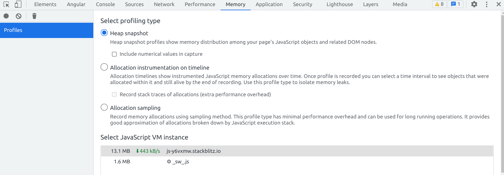
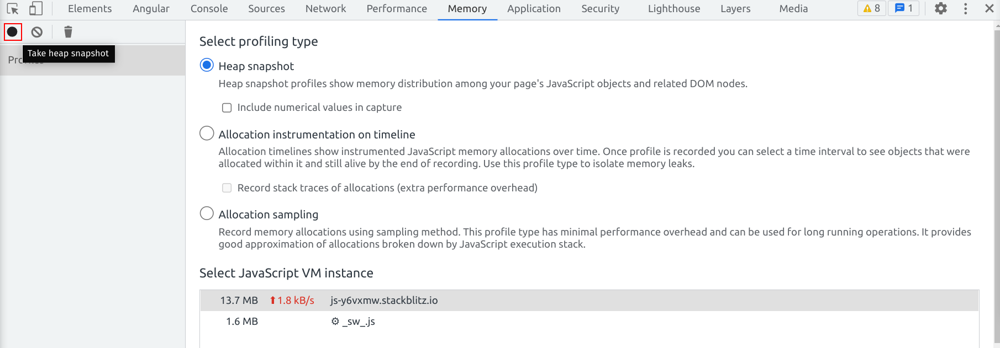
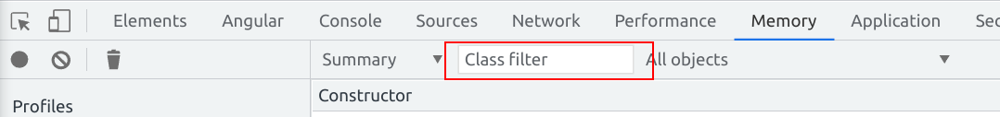
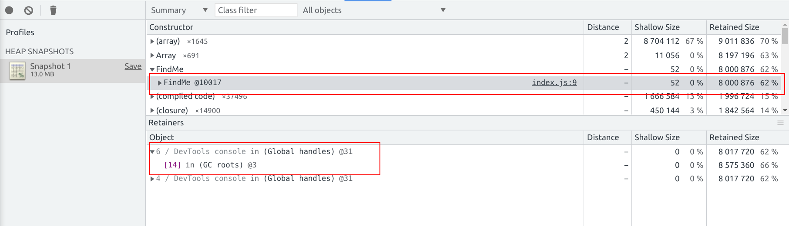
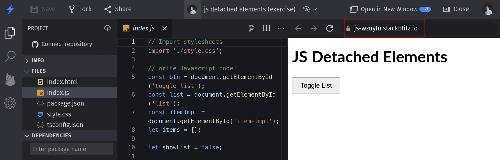
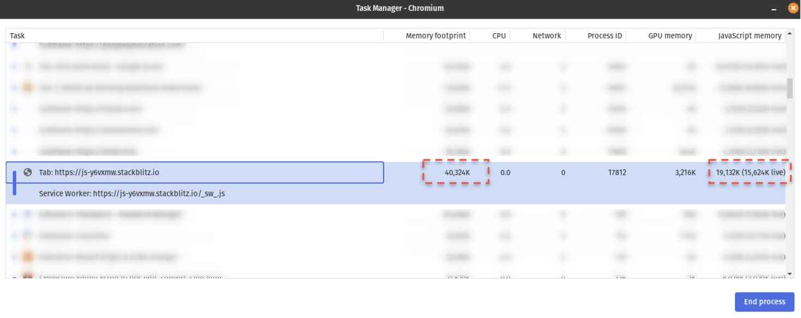
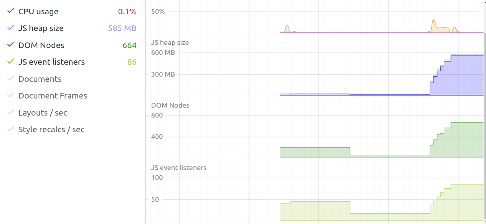
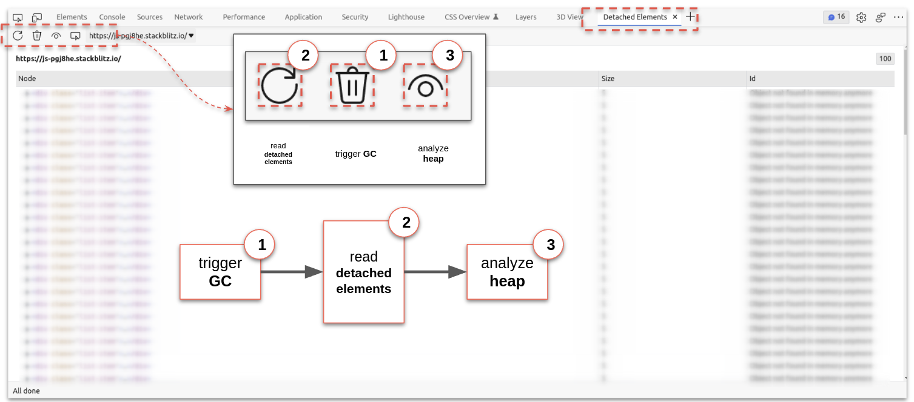
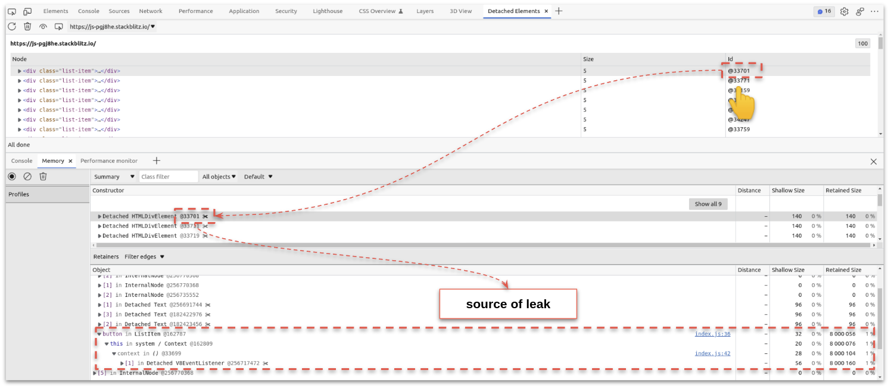

# JS Memory Debugging Exercise

The goal of this exercise is to deepen your knowledge about the memory usage of javascript
applications. In this exercise you will get to know the basics of how to generate, analyse and read memory heap
snapshots. Furthermore, you will learn how to detect memory leaks in an application with the brand new `detached elements tool`.

## Memory Heap Analysis

Visit the following [stackblitz example application](https://js-y6vxmw.stackblitz.io).
The screen should tell nothing else than `JS Starter`. This is fine, though as we only want to inspect
the memory heap and don't need any visual application interface for it.

In order to generate a heap snapshot, pen your Dev Tools with `F12` or `Ctrl + Shift + I` and head to the `Memory` tab.



Now hit the `Take heap snapshot` button and let the dev tools analyse
the outcome.



Take a look at the elements being held in memory by the application.
You should be able to find an entry called `FindMe`.

> You can use the search function in order to find it.



Your task now is to find out the reason why `FindMe` is still kept in memory.
The `Retainers` list should give you a hint about it.

<details>
  <summary>Show Retainer Hint</summary>



</details>

If you've found the reason why `FindMe` is still in memory, congratulations!

Head over to the next exercise :-)

## In-Depth Memory Analysis & Detached Elements tool

> use the [microsoft edge](https://www.microsoft.com/de-de/edge) browser for this exercise, to have access to the
> `detached elements` tool

Please use this plain javascript example as a starting point for your exercise.
[memory debugging exercise](https://stackblitz.com/edit/js-wzuyhr?file=index.js).

> please fork the project :-)

**Important information:**

Debugging is easier and should happen in the dedicated application window, not in the stackblitz embedded
editor, as the editor might corrupt your results.

Please open a dedicated browser window which serves only the application.

The url you need to open is here:  


### Get an overview of the memory usage

The first thing we want to do is to get an overview about the current memory usage of the
application.

Please open the `task manager (Shift + ESC)` and the `dev tools performance monitor`

Task Manager:



Performance Monitor:  


Once done, go to your application window, do a hard-refresh & trigger the garbage collector
to have a clean start for your analysis.

While observing the task manager & the performance monitor,
start interacting with the `Toggle List` button multiple times in a row.

You should see the heap size, amount of dom nodes and js event listeners
continuously increasing, similar to this:



The result should stay the same, even if trigger the garbage collection via the memory tab.
Congrats, you have successfully confirmed that we have a memory leak.

### Find the cause of the leak

Open the dev tools and go to the detached elements tab.

Click the `toggle list` button so that no list item should be there anymore. You can also double-check
the `Elements` tab if you want to see that the DOM is empty now.

Make sure the garbage collector was triggered, then get the list of detached elements
and start analyzing the memory heap.



You should now see a list of `detached elements`. Select the `id` of a node in order
to reveal its `retainers list`. This is the place where you will find the source(s)
of the leaked dom node.

Your task now is to identify all possible reasons why we still have dom nodes in our memory
even though we've cleaned up the DOM tree.

<details>
  <summary>Show Help</summary>



> There are actually two reasons why the list items are still kept in memory.
> 
> EventListener to a global scoped element (`boldToggle`)
> 
> `console.log()` statement in `onClick` handler

</details>

Congratulations, you have successfully identified the root cause of a memory leak. Let's move
on and fix it!

### Fix the leak

Now that you've identified the locs that causes the memory leak, let's focus on fixing it.
Go back to the source code of the application and think about a reason why the elements
are becoming detached elements instead of getting cleaned up properly.

If you have come to a conclusion on why the element is not cleaned up, move on
and implement the fixes.

<details>
  <summary>Reasons for the leak</summary>

There are actually two reasons why the list items are still kept in memory.


**1. EventListener to a global scoped element (`boldToggle`)**

```js
boldToggle.addEventListener('change', () => {
  this.node.classList.toggle('bold', boldToggle.checked);
});
```

**2. `console.log(event)` statement in `onClick` handler**

This leak only happens after the `EventHandler` was called once. The issue is
that the console needs to keep `event` as in memory as the console needs a reference
to that object in order to display it.

```js
onClick(event) {
  this.counter++;
  console.log('clicked', event, this.counter);
  this.content.innerHTML = `Item Content ${this.counter}`;
}
```

</details>

> Remove the `console.log` from the `click` event listener.

<details>
  <summary>Show Help</summary>

Remove the `console.log` from the `click` event listener.

```js
onClick(event) {
  this.counter++;
  this.content.innerHTML = `Item Content ${this.counter}`;
}
```

</details>

After applying the fix, confirm that the leaks are gone by repeating the analysis process from before.


 
> Remove access to global scope on destroy

_hint_: Think about `ngOnDestroy`

<details>
  <summary>Show Help</summary>

Introduce a local variable for the callback function
to be accessible. Replace the current `addEventListener` to use that callback instead.

```js
listener = () => {
  this.node.classList.toggle('bold', boldToggle.checked);
};

constructor() {
  /** other stuff **/
  boldToggle.addEventListener('change', this.listener);
}
```

Implement a `destroy` method for the `ListItem` class

```js
destroy() {
  boldToggle.removeEventListener('change', this.listener);
}
```

Call the `destroy` method when destroying the list.

```js
function destroyList() {
  list.innerHTML = '';
  // destroy items
  items.forEach(i => i.destroy());
  items = [];
}
```

</details>

After applying the fix, confirm that the leaks are gone by repeating the analysis process from before.


**Congratulations!!!!!!**
