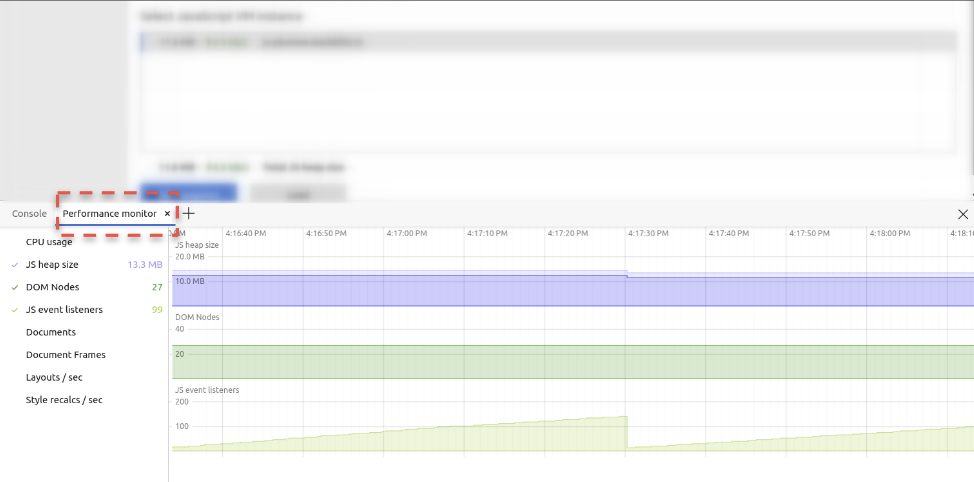

# JS Memory Debugging Exercise

> use the [microsoft edge](https://www.microsoft.com/de-de/edge) browser for this exercise, to have access to the
> `detached elements` tool

The goal of this exercise is to deepen your knowledge about the memory usage of javascript
applications.

Please use this plain javascript example as a starting point for your exercise.
[memory debugging exercise](https://stackblitz.com/edit/js-wzuyhr?file=index.js).

> please fork the project :-)

**Important information:**

Debugging is easier and should happen in the dedicated application window, not in the stackblitz embedded
editor, as the editor might corrupt your results.

Please open a dedicated browser window which serves only the application.

The url you need to open is here:  


## Get an overview of the memory usage

The first thing we want to do is to get an overview about the current memory usage of the
application.

Please open the `task manager (Shift + ESC)` and the `dev tools performance monitor`

Task Manager:


Performance Monitor:  



Once done, go to your application window, do a hard-refresh & trigger the garbage collector
to have a clean start for your investigation.

While observing the task manager & the performance monitor,
start interacting with the `Toggle List` button multiple times in a row.

You should see the heap size, amount of dom nodes and js event listeners
continuously increasing, similar to this:

<details>
  <summary>Show Help</summary>


</details>

The result should stay the same, even if trigger the garbage collection via the memory tab.
Congrats, you have successfully confirmed that we have a memory leak.

## Find the cause of the leak

Open the dev tools and go to the detached elements tab.

Make sure the garbage collector was triggered, then get the list of detached elements
and start analyzing the memory heap.

<details>
  <summary>Show Help</summary>


</details>

You should now see a list of `detached elements`. Select the `id` of a node in order
to reveal its `retainers list`. This is the place where you will find the source
of the leaked dom node.

<details>
  <summary>Show Help</summary>


</details>

Congratulations, you have successfully identified the root cause of a memory leak. Let's move
on and fix it!

## Fix the leak

Now that you've identified the loc that causes the memory leak, let's focus on fixing it.
Go back to the source code of the application and think about a reason why the elements
are becoming detached elements instead of getting cleaned up properly.

If you have come to a conclusion on why the element is not cleaned up, move on
and implement a fix for it.

_hint_: Think about `ngOnDestroy`

<details>
  <summary>Reason for the leak</summary>

The reason for the memory leak is the opened `EventListener` to the button element which
is never being removed.

```js
this.button.addEventListener('click', (event) => {
    this.onClick(event);
});
```

</details>

<details>
  <summary>Fix for the leak</summary>

Implement a `destroy` method for the `ListItem` class

```js
destroy() {
  this.button.removeEventListener('click', this.onClick);
}
```

Call the `destroy` method when destroying the list.

```js
function destroyList() {
  list.innerHTML = '';
  // destroy items
  items.forEach(i => i.destroy());
  items = [];
}
```

</details>

After implementing the fix, confirm that the leaks are gone by repeating the analysis process from before.

Congratulations!!!!!!
