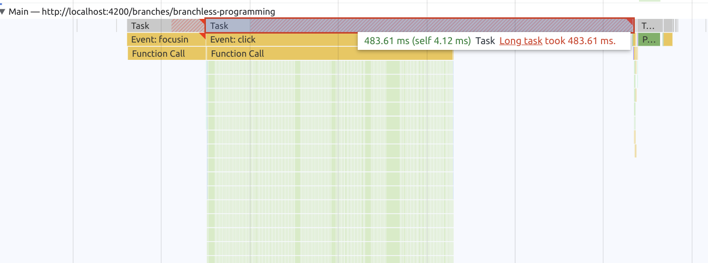
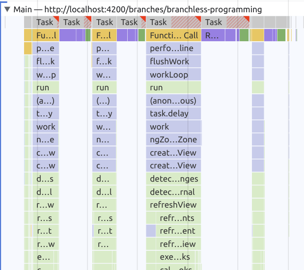

# Scheduling Exercise: Prioritize Work

We learned about how scheduling can improve the performance of our application. The next to step is to not only splice up
the work executed in our application, but also control the execution timing of it in order to improve the
UX.

In order to solve the tasks for this exercise, please clone the [perf-playground repository](https://github.com/push-based/perf-playground).

```bash
git clone https://github.com/push-based/perf-playground.git

cd perf-playground

npm install

npm run start
```

Open your browser at `http://localhost:4200/scheduling/prioritize`. You should see a skeleton which looks like
a typical web application divided into 4 sections:

* sidebar
* header
* content
* footer

Each of these sections contain content with different "weight" in order to be able to let simulate scenarios with different
sized apps.

The amount of work executed per section can be configured by changing the value of the `work` input.

## Analyse current state

Start by navigating to and from the exercise application. With the default setting (`work = 300`), you should already
notice a slight delay when navigating to the view.

Confirm your feeling by creating a recording of the navigation event and investigate the outcome for potential `long tasks`.

For this, open the dev tools with `F12` or `Ctrl + Shift + I` and go to the `Performance Tab`.
Hit the `record` button and do the navigation. When you've finished, stop the recording by again hitting the record button.


You should see a result similar to the following.



## Make rendering unblocking

If you take a look at the template of `PrioritizeComponent`, you will notice that all the values are bound with `async` pipes.

Your task is to introduce the `rxLet` and replace the usage of `async` pipe in order to divide the work being done into pieces.

<details>
  <summary>Show Help</summary>


```html
<!--prioritize.component.html-->

<div class="sidebar">
  Sidebar
  <pp-work *rxLet="sidebarWork$; let work" [work]="work"></pp-work>
</div>
<div class="header">
  Header
  <pp-work *rxLet="headerWork$; let work" [work]="work"></pp-work>
</div>
<div class="content">
  Content
  <pp-work *rxLet="contentWork$; let work" [work]="work"></pp-work>
</div>
<div class="footer">
  Footer
  <pp-work *rxLet="footerWork$; let work" [work]="work"></pp-work>
</div>
```

</details>

Great, now repeat the recording from before and take a look at the result.
You should observe how `rxLet` directive separated the work of each section into its own piece of work, thus making the navigation
event much faster.

Your measurement should be comparable to this example:



Well done! 

## Prioritize work

Now that we've pulled our template work apart, we can go ahead and think about in which order we might want to render
our template.

Most of the time, the important parts are rendered withing the `body/content` section of an application. Right now,
the `rxLet` directive will simply execute the work in order in which it is defined in the template. For our demo application
this means the `sidebar` will be rendered first, the `header` second, `content` third and `footer` last.

In order to achieve the goal of rendering the `content` first, we can make use of the concept of `prioritization`.

> Tip: Priorities are abstracted by the concept of `RenderStrategies`
> 
> 1 - `immediate`
> 2 - `userBlocking`
> 3 - `normal`
> 4 - `low`
> 5 - `idle`

Your task is to apply fitting `RenderStrategies` to the `rxLet` directive instances in order to make the `content` be rendered
first.

There are different ways in order to solve this task. As an additional exercise you can also try to optimise the performance even
further by fine-tuning the strategies of all directives. This will also mean to consider the `render deadlines` for each of the strategies.

I recommend the following order of rendering:

* `content`
* `sidebar`
* `header`
* `footer` (completely non-blocking)

After you've assigned different strategies, do another recording so that you can compare the runtime performance directly after
changing the values.

You might also want to consider `update` scenarios. The strategies not only affect the bootstrap phase of the component, but also
received updates during its lifecycle. By changing the `work` input value, you'll notice that the updates also are executed in order
of the configured strategies.
